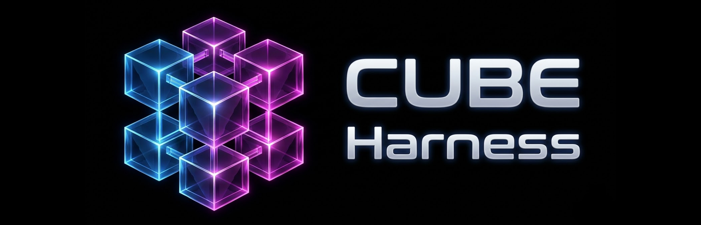

# cube-harness

Open source harness for building and evaluating AI agents using the [CUBE Standard](https://github.com/The-AI-Alliance/cube-standard).

**[CUBE Standard](https://github.com/The-AI-Alliance/cube-standard)** defines the benchmark protocol. **cube-harness** is the evaluation runtime: it runs agents against any CUBE-compatible benchmark, records trajectories, and scales execution with Ray.

> [!NOTE]
> **cube-harness is in active development (alpha).** Interfaces may change. We welcome early adopters and contributors who want to shape the framework, not just use it.
> See our [Roadmap](ROADMAP.md) and [Contributing Guide](CONTRIBUTING.md).
>
> **Want to change the harness itself?** Start with [Changing cube-harness](CONTRIBUTING.md#changing-cube-harness) and the project [Design Philosophy](https://the-ai-alliance.github.io/cube-standard/design-philosophy); the `/gatekeep-rfc` skill lets you check your own draft before anyone else reads it.
>
> **Have a benchmark to contribute?** [Fill out this short form](https://docs.google.com/forms/d/e/1FAIpQLSddMFyRXZJPpD0I2K27OEmIPUpj57w--u2NuMscrjNlkqy8rQ/viewform) — no commitment required. Want to go deeper? [Apply to join the core team](https://forms.gle/JFiBi4ynfVLMghAH8).

<!-- [Published Documentation](https://the-ai-alliance.github.io/cube-harness/) -->

## Quickstart

### Installation

```bash
# Clone the repository
git clone https://github.com/The-AI-Alliance/cube-harness.git
cd cube-harness

# Install dependencies
make install
```

### API Keys

Set your OpenAI API key:

```bash
export OPENAI_API_KEY=your-key-here
```

Any [LiteLLM-supported provider](https://docs.litellm.ai/docs/providers) works — just change `model_name` in the recipe.

### Run Tests

```bash
make test
```

### Run Hello Example

The [`hello_miniwob`](recipes/hello_miniwob.py) recipe demonstrates running a ReAct agent on the MiniWob benchmark.

**Start here** — first 2 tasks, in-process (fast, no Ray required):

```bash
make debug          # → uv run recipes/hello_miniwob.py --limit 2
```

Full benchmark (parallel via Ray):

```bash
make hello          # → uv run recipes/hello_miniwob.py
```

### Configuration

A recipe is a declarative config file: it imports canonical configs by name,
tweaks a few attributes, builds one or more `Experiment` objects, and ends
with `run(...)`. **Copy a recipe from [`recipes/`](recipes/) and edit it** —
recipes are documentation-by-example, not a CLI.

```python
from cube_harness.agents.genny_configs import GENNY_CONFIGS  # "default", "swe"
from cube_harness.infra import INFRA_CONFIGS                  # ~/.cube/infra.py; "local" built in
from cube_harness.recipe import run

agent = GENNY_CONFIGS["swe"]          # every lookup is a fresh deep copy
agent.budget.cost_limit = 2.0         # validated at the assignment site

exp = Experiment(name="x", agent_config=agent, benchmark_config=..., infra=INFRA_CONFIGS["local"])
if __name__ == "__main__":
    run(exp)                          # or run(exp_a, exp_b)
```

`run()` is the only CLI, identical for every recipe and not extensible:
`--limit N` (first N tasks, in-process), `--ray N` (worker count),
`--set dotted.path=value` (ad-hoc override). For anything structural, clone
the file. Config objects are typed Pydantic models, serialized with every
experiment for reproducibility.

**Infra** is machine-local in `~/.cube/infra.py` (a `dict[str, InfraConfig]`,
never committed; credentials come from env). `"local"` works with zero setup.
To use a cluster/cloud, copy [`recipes/infra_template.py`](recipes/infra_template.py)
to `~/.cube/infra.py` and edit it — it documents the process and shows
LocalInfraConfig plus commented Toolkit/Azure examples.

See **[docs/configuration.md](docs/configuration.md)** for the full philosophy, a comparison with Hydra/YAML/CLI approaches, and how to run sweeps.

## Experiment Viewer

cube-harness includes a Gradio-based XRay UI for exploring experiment results, trajectories, and OpenTelemetry spans:

```bash
make xray
# or: uv run ch-xray
```

The viewer displays:
- **Trajectory list** — all runs with task ID, steps, reward, and duration
- **Visual timeline** — color-coded steps (blue=environment, green=agent) with duration-based widths
- **Screenshots** — environment state at each step
- **Step details** — observations, agent actions, and LLM reasoning
- **Debug data** — raw JSON, LLM calls, and tool configurations


## Architecture Overview

cube-harness is a **universal evaluation platform** for agentic benchmarks and an **RL data generation** framework built on top of the [CUBE Standard](https://github.com/The-AI-Alliance/cube-standard).

### Core Components


- **Agent** — LLM-powered decision maker that receives observations and produces actions
- **Environment** — Executes actions, provides observations and rewards (tool + task composition)
- **Tool** — Modular action provider that exposes an action space, reusable across benchmarks
- **ActionSpace** — Defines the set of possible actions a tool can execute
- **Task** — Defines goals, validation logic, and action subsets
- **Trajectory** — Stores interaction history (observations, actions, rewards)
- **Episode** — Single agent-environment loop for one task; records a trajectory
- **Benchmark** — Collection of tasks; produces env configs for episodes
- **Experiment** — Coordinates execution of multiple episodes across a benchmark
- **ExpRunner** — Execution runtime (sequential or parallel via Ray)

### Design Goals

1. **Benchmark Agnostic** — Plug in any CUBE-standard benchmark (MiniWob, WebArena, OSWorld, …) via the `Benchmark` interface
2. **Agent Agnostic** — Support any agent architecture by implementing the `Agent` protocol
3. **RL-Ready** — Trajectory format designed for training data generation with full LLM call logging
4. **Scalable** — Ray integration for parallel episode execution across multiple workers
5. **Observable** — Structured trajectory output for analysis and debugging

## Development

```bash
make format    # Format code
make lint      # Lint and auto-fix
make help      # Show all commands
make test      # Run tests
make coverage  # Run tests with coverage report
```

### Pre-commit hooks

Install once after cloning to get ruff lint/format, trailing-whitespace checks, and DCO sign-off enforcement on every commit:

```bash
pre-commit install --hook-type pre-commit --hook-type commit-msg --hook-type prepare-commit-msg
```

The `prepare-commit-msg` hook automatically appends `Signed-off-by: Your Name <email>` to every commit message (required by the DCO). You can also sign off manually with `git commit -s`.

## Project Structure

```
cube-harness/
├── src/cube_harness/   # Source code for the framework
├── tests/              # Test suite
├── recipes/            # Example recipes and configurations
├── docs/               # Project documentation
└── Makefile            # Common task shortcuts
```

## Getting Involved

All contributions are welcome — open an issue, submit a PR, or wrap a new benchmark. See [CONTRIBUTING.md](CONTRIBUTING.md) for the development guide, DCO requirements, and RFC process.

Want deeper involvement? Join the core team, shape the roadmap, and get credit for what you build. [Apply here](https://forms.gle/JFiBi4ynfVLMghAH8).

For general AI Alliance contribution guidelines, see the [community repo](https://github.com/The-AI-Alliance/community/).
