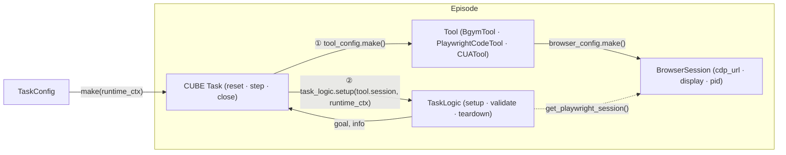

# BrowserTool Redesign

## Terminology

| Term | Meaning |
|---|---|
| **CUBE Task** | The gym-like orchestrator from `cube-standard`. Created via `task_config.make()`. Manages the episode: `reset()` → `step()` → `close()`. |
| **TaskLogic** | Sets up a specific web scenario. Receives a `BrowserSession` and `RuntimeContext` in `setup()`, returns `(goal, info)`. Also provides `validate()` and `teardown()`. Knows nothing about which tool executes actions. |
| **BrowserSession** | Serializable handle to a running browser. Stores only plain data (`cdp_url`, `pid`, `display`). Playwright objects are lazy private attributes accessed via `get_playwright_session()`. |
| **BrowserSessionConfig** | Serializable browser launch config. `make() -> BrowserSession` starts the browser and injects live Playwright objects directly (no CDP round-trip in same-process). |
| **ToolConfig** | Serializable config for a tool. `make() -> Tool` starts the browser via `browser_config.make()` and creates a connected tool. |
| **Tool** | Executes actions on the browser. Owns the `BrowserSession` lifecycle. Exposes `session` so CUBE Task can pass it to TaskLogic. |
| **BgymTool** | Lean wrapper over BrowserGym's standalone action and observation functions. No `BrowserEnv` — operates directly on a Playwright `Page` from a `BrowserSession`. |
| **RuntimeContext** | `dict[str, Any]` — shared infrastructure references created in `Benchmark._setup()` (e.g. server URLs). Passed through `TaskConfig.make()` into `TaskLogic.setup()`. |

---

## Core Principle: Tool-Agnostic TaskLogic

A task (WorkArena, WebArena, MiniWob, …) should be instantiable without knowing which tool will execute its actions. TaskLogic owns the *what* (navigate, validate, tear down); the Tool owns the *how* (which action space, which observation format).

This means any web task can run under:
- `BgymTool` — BID-based BrowserGym actions, BrowserGym observations
- `PlaywrightCodeTool` — Python/Playwright code actions, custom observations
- `CUATool` — OS-level screenshots and input dispatch
- Sync or async variants of any of the above

The tool is chosen at benchmark or experiment level, not inside the task:

```python
# Same task logic, different tool — swap at benchmark level
workarena = WorkArenaBenchmark(snow_url="...", level="l1")
workarena.default_tool_config = BgymToolConfig(...)        # BID actions
workarena.default_tool_config = PlaywrightCodeToolConfig() # code actions
workarena.default_tool_config = CUAToolConfig(...)         # OS-level CUA
```

---

## Architecture



---

## Design Decisions

### 1. Tool owns the BrowserSession

The Tool creates and owns the browser. `tool_config.make()` calls `browser_config.make()` and returns a tool with a live `session`. The CUBE Task extracts `tool.session` and passes it to `task_logic.setup(session, runtime_context)`.

```python
def reset(self) -> tuple[Observation, dict]:
    self._tool = self.tool_config.make()
    goal, info = self.task_logic.setup(self._tool.session, self.runtime_context)
    return goal, info  # goal is already an Observation — TaskLogic owns the conversion
```

Key consequences:
- **`browser_config` lives on `tool_config`** — co-located with the object that uses the browser at every step.
- **CUBE Task is lean** — only `task_logic + tool_config`, no separate `browser_config` field.
- **TaskLogic is pure** — setup, validate, teardown only. No browser management.

### 2. TaskLogic receives a full BrowserSession

All three TaskLogic methods receive the `BrowserSession` and call `get_playwright_session()` themselves when they need a page. This keeps the CUBE Task from knowing anything about how Playwright is used.

```python
class AbstractTaskLogic(ABC):
    @abstractmethod
    def setup(self, session: BrowserSession, runtime_context: RuntimeContext) -> tuple[Observation, dict]: ...

    @abstractmethod
    def validate(self, session: BrowserSession) -> tuple[float, bool, dict]: ...

    def teardown(self, session: BrowserSession) -> None: ...
```

TaskLogic decides whether it needs the page and how — e.g. WorkArena's `validate()` uses HTTP API calls and rarely touches the page; a MiniWob TaskLogic might call `page.evaluate()` for JS-based validation.

### 3. `BrowserSession` is serializable; Playwright connection is lazy

`BrowserSession` is a Pydantic model — only plain data is serialized (`cdp_url`, `pid`, `display`). Playwright objects live in private attributes, initialized on first call to `get_playwright_session()`.

Two initialization paths:

| Path | When | How |
|---|---|---|
| **Same-process** | `browser_config.make()` | Private attrs `_page`/`_context`/`_playwright` are injected directly. `get_playwright_session()` returns immediately — no CDP round-trip. |
| **Cross-process** | Session deserialized from JSON | `get_playwright_session()` calls `connect_over_cdp(cdp_url)`, caches connection, returns page. |

```python
class BrowserSessionConfig(TypedBaseModel):
    """Browser launch parameters. make() starts a browser and returns a live session."""
    headless: bool = True
    viewport: dict = {"width": 1280, "height": 720}
    cdp_port: int | None = None   # None → no CDP exposure (same-process only)
    display: str | None = None    # X11 display e.g. ":99"; required for CUA

    def make(self) -> "SyncBrowserSession": ...
    async def amake(self) -> "AsyncBrowserSession": ...


class BrowserSession(TypedBaseModel, ABC):
    """Serializable handle to a running browser. Playwright objects are not serialized.

    Call get_playwright_session() to obtain (page, context). Same-process: returns
    immediately. Cross-process: connects via CDP on first call, then caches.
    """
    cdp_url: str | None = None
    display: str | None = None
    pid: int | None = None

    def stop(self) -> None: ...


class SyncBrowserSession(BrowserSession):
    """Sync Playwright. Primary path."""
    def get_playwright_session(self) -> tuple[SyncPage, SyncBrowserContext]: ...
    def stop(self) -> None: ...


class AsyncBrowserSession(BrowserSession):
    """Async Playwright. For high-throughput parallel collection."""
    async def get_playwright_session(self) -> tuple[AsyncPage, AsyncBrowserContext]: ...
    async def stop(self) -> None: ...
```

> **Note — CDP is Chromium-only.** `cdp_url` works with Chrome, Chromium, and Edge. Firefox (WebDriver BiDi) and WebKit/Safari have no CDP support. The `cdp_url` field is also the escape hatch for non-Playwright tools: Puppeteer connects via `puppeteer.connect({ browserWSEndpoint: cdp_url })` and Selenium 4 via `ChromeOptions.debugger_address`. A `SeleniumToolConfig` would subclass `BrowserSession` and expose `get_selenium_driver()` instead of `get_playwright_session()`.

### 4. Sync vs Async Playwright: two derived classes

`SyncPage` and `AsyncPage` are different Playwright types requiring different calling conventions. A flag would make return types ambiguous and break type checkers. Two derived classes keeps the hierarchy type-safe.

**Primary path is sync** — CUBE-standard is synchronous.

```python
# Sync — standard path
tool = BgymToolConfig(browser_config=BrowserSessionConfig()).make()
page, ctx = tool.session.get_playwright_session()   # SyncPage

# Async — high-throughput collection
tool = await AsyncBgymToolConfig(browser_config=BrowserSessionConfig()).amake()
page, ctx = await tool.session.get_playwright_session()   # AsyncPage
```

The sync/async split propagates to tools and CUBE Tasks; the two hierarchies do not mix.

### 5. RuntimeContext

`RuntimeContext = dict[str, Any]` — carries shared infrastructure references created once in `Benchmark._setup()` (server URLs, credentials) and passed through to each task at spawn time.

```
Benchmark._setup()    → populates self._runtime_context
Benchmark.spawn()     → task_config.make(runtime_context=self._runtime_context)
TaskConfig.make()     → stores runtime_context on BrowserTask
BrowserTask.reset()   → task_logic.setup(session, runtime_context)
```

### 6. BgymTool: lean layer, no BrowserEnv

`BgymTool` wraps BrowserGym's standalone functions directly on a `Page`. `BrowserEnv` is not used.

BrowserGym exposes:
- **Actions:** `HighLevelActionSet.to_python_code(action_str)` + `execute_python_code(code, page, ...)`
- **Observations:** `_pre_extract(page)` (BID injection) + `extract_screenshot(page)` + `extract_merged_axtree(page)` + `extract_dom_snapshot(page)`

`BgymTool` calls these functions on the `page` it gets from its `SyncBrowserSession`. It is unaware of any task — it only knows how to execute actions and extract observations.

### 7. Remove WebAction Protocols ✅

`BrowserActionSpace` and `BidBrowserActionSpace` are too rigid. Tools override `action_set` directly — `BgymTool` builds it from `HighLevelActionSet` (one `ActionSchema` per BrowserGym action), and `execute_action` serializes any `Action` back to a Python code string for `execute_python_code`. No Protocol class needed.

### 8. CUA tool needs OS-level access — not CDP ✅ confirmed by experiment

Playwright screenshots miss OS-rendered widgets and the browser chrome. CDP input dispatch fails on native UI elements. CUA requires:
- Browser launched **headful on a real or virtual display** (Xvfb on Linux).
- OS-level screen capture (`mss`/`scrot`) via `DISPLAY=session.display`.
- OS-level input dispatch (`xdotool`) targeting the browser window via `session.pid`.

---

## Key Classes

### CUBE Task

```python
class BrowserTask(Task, ABC):
    task_logic: AbstractTaskLogic
    tool_config: ToolConfig          # browser_config lives inside tool_config
    runtime_context: RuntimeContext = Field(default_factory=dict)

    _tool: AbstractTool | None = None   # runtime only

    def reset(self) -> tuple[Observation, dict]:
        self._tool = self.tool_config.make()
        goal, info = self.task_logic.setup(self._tool.session, self.runtime_context)
        return goal, info  # goal is already an Observation — TaskLogic owns the conversion

    def step(self, action: Action) -> EnvironmentOutput:
        obs = self._tool.execute_action(action)
        if self.validate_per_step:
            reward, done, step_info = self.task_logic.validate(self._tool.session)
            return EnvironmentOutput(obs=obs, reward=reward, done=done, info=step_info)
        return EnvironmentOutput(obs=obs)

    def evaluate(self, obs: Observation) -> tuple[float, dict]:
        reward, _, info = self.task_logic.validate(self._tool.session)
        return reward, info

    def close(self) -> None:
        self.task_logic.teardown(self._tool.session)
        self._tool.close()
```

### AbstractTaskLogic

```python
class AbstractTaskLogic(ABC):
    @abstractmethod
    def setup(self, session: BrowserSession, runtime_context: RuntimeContext) -> tuple[Observation, dict]:
        """Navigate to the task URL, initialize state. Returns (goal, info).
        Goal is an Observation — may contain text, images, or both (e.g. VisualWebArena).
        Call session.get_playwright_session() to get the page when needed."""
        ...

    @abstractmethod
    def validate(self, session: BrowserSession) -> tuple[float, bool, dict]:
        """Check task completion. Returns (reward, done, info).
        May use session.get_playwright_session() or external API calls."""
        ...

    def teardown(self, session: BrowserSession) -> None:
        """Optional cleanup (e.g. delete test users, reset server state)."""
```

### BrowserToolConfig / BgymToolConfig / BgymTool

```python
class BrowserToolConfig(ToolConfig, ABC):
    """Base config for tools that own a BrowserSession.

    Subclass this for any tool that launches and manages its own browser process.
    """
    browser_config: BrowserSessionConfig = Field(default_factory=BrowserSessionConfig)

    @abstractmethod
    def make(self) -> "BrowserTool": ...


class BgymToolConfig(BrowserToolConfig):
    """BrowserGym-style BID actions and observations. BrowserEnv is not used."""
    action_subset: str = "workarena"   # "webarena", "miniwob_all", …
    use_screenshot: bool = True
    use_axtree: bool = True
    use_dom: bool = False

    def make(self) -> "BgymTool": ...


class BgymTool(Tool):
    """Thin layer over BrowserGym's standalone action and observation functions.

    Does not wrap BrowserEnv. Operates directly on the Page from BrowserSession.
    TaskLogic drives page navigation; this tool only handles actions and observations.

    action_set is derived from HighLevelActionSet — one ActionSchema per BrowserGym action
    (click, type, scroll, hover, …). execute_action serializes any Action back to a Python
    code string and dispatches via execute_python_code. BID injection (_pre_extract) runs
    automatically before every observation extraction.
    """
    session: SyncBrowserSession

    @property
    def action_set(self) -> list[ActionSchema]:
        """One ActionSchema per BrowserGym action in the configured subset."""
        ...

    def execute_action(self, action: Action) -> Observation:
        """Serialize action → Python code string → execute_python_code → extract obs."""
        ...

    def close(self) -> None: ...
```

### CUAToolConfig / CUATool

```python
class CUAToolConfig(TypedBaseModel):
    browser_config: BrowserSessionConfig   # must have display set, headless=False

    def make(self) -> "CUATool":
        session = self.browser_config.make()
        assert session.display is not None, "CUATool requires a display (headful browser)"
        return CUATool(session=session)


class CUATool(Tool):
    """OS-level screenshot and input dispatch via Xvfb + xdotool."""
    # screenshot: DISPLAY=session.display → mss / scrot
    # input:      xdotool mousemove/click/key -display session.display
    # focus:      xdotool search --pid session.pid → windowfocus
```

---

## Benchmark Implementations

### WorkArena

WorkArena task classes inherit from BrowserGym's `AbstractBrowserTask`. Their `setup(page)` and `validate(page, chat_messages)` take a raw Playwright `Page` directly — BrowserEnv is not involved.

Key observations from the actual WorkArena source:
- **`setup(page)`** creates a ServiceNow user, calls `setup_goal(page)` (subclass hook), logs in, navigates to start URL. Stores `self.page = page` internally.
- **`validate(page, chat_messages)`** mostly makes HTTP calls to the ServiceNow REST API; the `page` parameter is rarely used but available.
- **`teardown()`** takes **no arguments** — uses internally stored state to delete the test user via API.

`WorkArenaTaskLogic` receives a `BrowserSession`, calls `get_playwright_session()` to get the page, and passes it to the BrowserGym task. The tool (BgymTool, CUATool, etc.) is unknown to it.

```python
# --- TaskLogic ---
class WorkArenaTaskLogic(AbstractTaskLogic):
    """Adapts a WorkArena BrowserGym task class to the TaskLogic interface.

    The task class name is stored as a string for serialization; resolved
    to the actual class at runtime via the WorkArena task registry.
    The tool used for action execution is entirely irrelevant to this class.
    """
    task_class_name: str   # e.g. "WorkarenaL1CreateIncidentTask"
    seed: int

    _bgym_task: AbstractBrowserTask | None = PrivateAttr(default=None)

    def setup(self, session: SyncBrowserSession, runtime_context: RuntimeContext) -> tuple[Observation, dict]:
        snow_url = runtime_context.get("snow_url")
        task_cls = WORKARENA_TASK_CLASSES[self.task_class_name]
        self._bgym_task = task_cls(
            seed=self.seed,
            instance=SNowInstance(snow_url=snow_url) if snow_url else None,
        )
        page, _ = session.get_playwright_session()
        goal_str, info = self._bgym_task.setup(page)
        return Observation.from_text(goal_str), info

    def validate(self, session: SyncBrowserSession) -> tuple[float, bool, dict]:
        # WorkArena validate uses ServiceNow HTTP API — page is available but rarely used
        page, _ = session.get_playwright_session()
        reward, done, _, info = self._bgym_task.validate(page, chat_messages=[])
        return reward, done, info

    def teardown(self, session: SyncBrowserSession) -> None:
        # WorkArena teardown takes no args — it stored self.page internally during setup()
        if self._bgym_task is not None:
            self._bgym_task.teardown()


# --- TaskConfig ---
class WorkArenaTaskConfig(TaskConfig):
    task_id: str
    task_class_name: str
    seed: int
    # No tool_config — the benchmark provides the default tool.
    # Override tool_config on the TaskConfig only when a specific task needs a different tool.

    def make(
        self,
        runtime_context: RuntimeContext | None = None,
        container_backend: ContainerBackend | None = None,
    ) -> BrowserTask:
        return BrowserTask(
            metadata=TaskMetadata(id=self.task_id),
            task_logic=WorkArenaTaskLogic(task_class_name=self.task_class_name, seed=self.seed),
            tool_config=self.tool_config,
            runtime_context=runtime_context or {},
        )


# --- Benchmark ---
class WorkArenaBenchmark(Benchmark):
    """WorkArena benchmark. Connects to a live ServiceNow instance.

    Set default_tool_config to switch the action space for all tasks:
        benchmark.default_tool_config = BgymToolConfig(...)        # BID actions (default)
        benchmark.default_tool_config = PlaywrightCodeToolConfig() # Playwright code actions
        benchmark.default_tool_config = CUAToolConfig(...)         # OS-level CUA
    """
    snow_url: str
    level: Literal["l1", "l2", "l3"] = "l1"
    seed_generator: BasicSeedGenerator = Field(
        default_factory=lambda: BasicSeedGenerator(n_seed=5, meta_seed=42)
    )
    default_tool_config: ToolConfig = Field(
        default_factory=lambda: BgymToolConfig(
            browser_config=BrowserSessionConfig(headless=True, viewport={"width": 1280, "height": 900}),
            action_subset="workarena",
            use_screenshot=True,
            use_axtree=True,
        )
    )

    def _setup(self) -> None:
        self._runtime_context = {"snow_url": self.snow_url}

    def get_task_configs(self) -> Generator[WorkArenaTaskConfig, None, None]:
        for task_cls, seed in get_all_tasks_agents(level=self.level):
            yield WorkArenaTaskConfig(
                task_id=task_cls.get_task_id(),
                task_class_name=task_cls.__name__,
                seed=seed,
                tool_config=self.default_tool_config,
            )

    def close(self) -> None:
        pass
```

### WebArena

Same structure as WorkArena — WebArena task classes are also BrowserGym `AbstractBrowserTask` subclasses.

```python
class WebArenaTaskLogic(AbstractTaskLogic):
    task_id: str   # e.g. "webarena.249"
    seed: int | None = None

    _bgym_task: AbstractBrowserTask | None = PrivateAttr(default=None)

    def setup(self, session: SyncBrowserSession, runtime_context: RuntimeContext) -> tuple[Observation, dict]:
        base_url = runtime_context.get("base_url")
        self._bgym_task = webarena_task_from_id(self.task_id, seed=self.seed, base_url=base_url)
        page, _ = session.get_playwright_session()
        goal, info = self._bgym_task.setup(page)
        # VisualWebArena returns list[Content] (text + images); standard WebArena returns str
        return Observation.from_goal(goal), info

    def validate(self, session: SyncBrowserSession) -> tuple[float, bool, dict]:
        page, _ = session.get_playwright_session()
        reward, done, _, info = self._bgym_task.validate(page, chat_messages=[])
        return reward, done, info

    def teardown(self, session: SyncBrowserSession) -> None:
        if self._bgym_task is not None:
            self._bgym_task.teardown()


class WebArenaBenchmark(Benchmark):
    """WebArena benchmark. Requires running server instances (Reddit, GitLab, Shopping, etc.)."""
    base_url: str
    default_tool_config: ToolConfig = Field(
        default_factory=lambda: BgymToolConfig(
            browser_config=BrowserSessionConfig(headless=True),
            action_subset="webarena",
            use_screenshot=True,
            use_axtree=True,
        )
    )

    def _setup(self) -> None:
        self._runtime_context = {"base_url": self.base_url}

    def get_task_configs(self) -> Generator[WebArenaTaskConfig, None, None]:
        for task_id in ALL_WEBARENA_TASK_IDS:
            yield WebArenaTaskConfig(
                task_id=task_id,
                tool_config=self.default_tool_config,
            )

    def close(self) -> None:
        pass
```

### Structural diff vs. current AL2

| Current AL2 | New design |
|---|---|
| `WorkArenaTask(Task)` with `setup(tool)` — knows about the tool | `WorkArenaTaskLogic` with `setup(session, runtime_context)` — tool-agnostic |
| `BrowsergymTool.set_gym_task(task_cls, seed)` — tool reconfigured by task | Tool is never reconfigured; TaskLogic drives the WorkArena task directly via `page` |
| `BrowsergymTool` wraps `BrowserEnv` | `BgymTool` calls BrowserGym's standalone functions directly on `Page` |
| `WorkArenaTask.filter_actions()` filters from a Protocol-defined action space | `BgymToolConfig.action_subset` selects action set at config time |
| Tool hardwired to task — no way to swap action space | Swap `Benchmark.default_tool_config` to run same tasks with BgymTool / Playwright / CUA |
| No `RuntimeContext` — server URL from env vars | `snow_url` / `base_url` explicit on benchmark, flows via `RuntimeContext` |

---

## What Gets Removed

| Current | Fate |
|---|---|
| `BrowserActionSpace` (Protocol) | deleted |
| `BidBrowserActionSpace` (Protocol) | deleted |
| `tools/base.py` (`BrowserTaskTool` Protocol) | deleted |
| `BrowsergymTool` (wraps `BrowserEnv`) | replaced by `BgymTool` (direct Page functions) |
| `BrowsergymTool.set_gym_task()` | deleted — TaskLogic instantiates the BrowserGym task |
| `WorkArenaTask.setup(tool)` | replaced by `WorkArenaTaskLogic.setup(session, runtime_context)` |

---

## Open Questions

1. **Multi-tab tasks (WorkArena L3):** `BrowserSession` exposes one default page. Extra tabs accessible via `session.get_playwright_session()[1].pages` (the context). Does `AbstractBrowserTask.teardown()` close extra tabs, or must TaskLogic handle them?

2. **`HighLevelActionSet` → `list[ActionSchema]`:** Should `BgymTool.action_set` expose one action (`execute_browser_action(action_str)`) or one action per BrowserGym action? Single action is simpler but loses per-action descriptions for the LLM.

3. **CDP port auto-assign:** `cdp_port=0` → `socket.bind(("", 0))` before launch to grab a free port. Essential for parallel runs.

4. **BID injection timing:** `_pre_extract(page)` must run before every obs extraction. In `_extract_obs()` — correct. Must not run in TaskLogic.

5. **`validate_per_step` on BrowserTask:** WorkArena needs `validate_per_step=True` — its reward signal is produced per step. `evaluate()` is for episode-end scoring (final reward).

6. **Async scope:** `AsyncBrowserTask` requires an async episode runner. Is async in-scope for the initial implementation?

7. **WorkArena `chat_messages` in validate:** `validate(page, chat_messages=[])` passes an empty list. WorkArena L2/L3 may need the conversation history. Should `validate(session, obs)` receive the full observation?

8. **`PlaywrightCodeTool`:** Not yet specified. It would expose a `execute_playwright_code(code: str)` action where the agent generates Playwright Python directly, without BID injection. Should it share `BgymTool`'s observation format?
