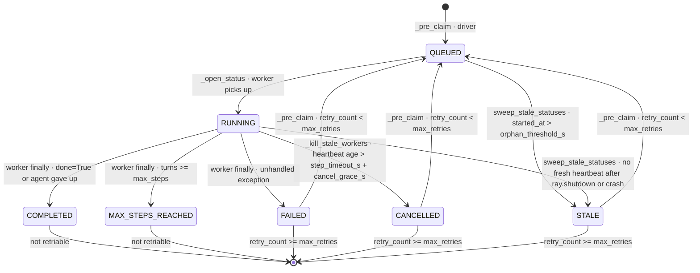

# RFC: Episode Status File

**Version:** 0.4 — aligned with implementation, 2026-04-28

## Problem

Resume / retry logic in `experiment.py` decides what to re-run by deserialising every
trajectory and scanning for `StepError`. This has four failure modes:

1. **Silent crash.** A Ray worker killed (OOM, `ray.cancel(force=True)`, machine
   failure) writes no terminal status. The trajectory is partial or missing. The
   current code catches the load failure silently and drops the episode — neither
   retried nor counted as done.

2. **False positive on recovered errors.** A `StepError` written mid-episode (an env
   error the harness caught and continued past) flips `_is_trajectory_successful` to
   `False`, triggering a needless retry of an episode that completed normally.

3. **Status requires reading the payload.** Checking whether N episodes are done
   means deserialising N trajectories. At benchmark scale this is slow, and a single
   corrupt step file breaks the check for that episode.

4. **Concurrent runner collision.** Two `run_with_ray` invocations on the same
   `output_dir` see the same unstarted episodes and both submit them to Ray. Nothing
   in the system detects or prevents this.

## Proposed solution

A small `status.json` per episode directory drives all retry decisions. The
trajectory is data; `status.json` is control.

The mechanism has three pieces:

1. **`status.json` per episode**, with a step-boundary heartbeat written from the
   worker's main thread.
2. **Driver poll loop** reads `status.json` from the filesystem instead of querying
   the Ray dashboard for elapsed time. Step-timeout is the only kill trigger.
3. **STALE sweep** cleans up orphaned in-flight entries from crashed drivers.

> **Load-bearing assumption**: `output_dir` is on a filesystem visible to both the
> driver and every Ray worker (NFS, shared object store, single host). This is
> already required for trajectory writes; this RFC just relies on it more pervasively.

---

### Episode statuses

| Status              | Written by                      | Meaning                                                       |
|---------------------|---------------------------------|---------------------------------------------------------------|
| `QUEUED`            | driver (`_pre_claim`)           | Submitted to Ray; worker hasn't picked it up yet              |
| `RUNNING`           | worker (`_open_status`)         | Worker is actively executing the episode                      |
| `COMPLETED`         | worker (`finally`)              | Loop reached natural end (`done=True` or agent gave up)       |
| `MAX_STEPS_REACHED` | worker (`finally`)              | Loop exhausted `max_steps` without `done=True`; not retriable |
| `FAILED`            | worker (`finally`)              | Unhandled exception propagated out of `_run_loop`             |
| `CANCELLED`         | driver (`_kill_stale_workers`)  | Step heartbeat went stale; driver force-killed the worker     |
| `STALE`             | `sweep_stale_statuses` (driver) | Worker died without writing a terminal status                 |

`QUEUED` and `RUNNING` are *in-flight* — never included in retry selection.
`COMPLETED` and `MAX_STEPS_REACHED` are terminal but *not retriable* — the agent
either succeeded or legitimately ran out of steps; a retry would just repeat from
a fresh initial state.

### State transition diagram



**Transition table:**

| From | To | Written by | Condition |
| --- | --- | --- | --- |
| `[none]` | `QUEUED` | driver · `_pre_claim` | First submission — no prior `status.json` exists |
| `[none]` | `RUNNING` | worker · `_open_status` | Sequential mode only — no pre-claim; worker writes `RUNNING` directly¹ |
| `QUEUED` | `RUNNING` | worker · `_open_status` | Worker picks up the episode and begins executing |
| `QUEUED` | `STALE` | driver · `sweep_stale_statuses` | `now − started_at > orphan_threshold_s` — never picked up by Ray |
| `RUNNING` | `RUNNING` | worker · heartbeat | Start of each turn — updates `last_heartbeat_at` and `current_step` only |
| `RUNNING` | `COMPLETED` | worker · `finally` | `done=True` or agent returned no actions |
| `RUNNING` | `MAX_STEPS_REACHED` | worker · `finally` | `turns >= max_steps` and `done` was never `True` |
| `RUNNING` | `FAILED` | worker · `finally` | Unhandled exception propagated out of `_run_loop` |
| `RUNNING` | `CANCELLED` | driver · `_kill_stale_workers` | `now − last_heartbeat_at > step_timeout_s + cancel_grace_s` → `ray.cancel(force=True)` |
| `RUNNING` | `STALE` | driver · `sweep_stale_statuses` | No fresh heartbeat after `ray.shutdown()` or driver crash |
| `FAILED` | `QUEUED` | driver · `_pre_claim` | `retry_count < max_retries` — archives prior dir, queues next attempt |
| `CANCELLED` | `QUEUED` | driver · `_pre_claim` | `retry_count < max_retries` — archives prior dir, queues next attempt |
| `STALE` | `QUEUED` | driver · `_pre_claim` | `retry_count < max_retries` — archives prior dir, queues next attempt |
| `FAILED` | `[terminal]` | — | `retry_count >= max_retries` — cap reached, permanently failed |
| `CANCELLED` | `[terminal]` | — | `retry_count >= max_retries` — cap reached, permanently failed |
| `STALE` | `[terminal]` | — | `retry_count >= max_retries` — cap reached, permanently failed |
| `COMPLETED` | `[terminal]` | — | Always — legitimate success, not retriable |
| `MAX_STEPS_REACHED` | `[terminal]` | — | Always — agent exhausted step budget, not retriable |

> ¹ **Known gap:** sequential mode currently skips `_pre_claim`, so episodes waiting
> their turn have no `status.json`. A crash mid-run makes them indistinguishable from
> episodes that were never submitted. The fix is to pre-claim all episodes upfront in
> `_run_sequentially_impl` before the loop starts — tracked as a follow-up.

---

### Step-boundary heartbeat

Inside `Episode._run_loop`, the worker writes `last_heartbeat_at` and `current_step`
to `status.json` at:

1. The very top of `_run_loop` (via `_open_status`) — covers stuck `setup_fn` (env
   reset, container boot).
2. The start of each turn, before `agent.step()` and before `step_fn()`.

That is the entire mechanism. **No background thread. No child process. No asyncio
interaction.** Just a file write in the worker's main thread at natural sync points.

**Why this works where threads and subprocesses didn't:**

- Ray workers run inside an asyncio event loop. A daemon thread doing I/O while the
  main thread is in an async call deadlocks or gets silently dropped on shutdown.
- Ray workers are daemon processes; Python disallows non-daemon children of daemons.

The step-boundary write avoids both because it doesn't run *concurrently* with the
episode — it runs *between* steps, on the same thread that's executing the episode.
It's not "obvious in hindsight"; it's a different topology.

---

### Pre-claim: race protection on submission

Before submitting episodes to Ray, the driver calls `_pre_claim(storage, episode)` for
every episode it intends to launch. This writes `QUEUED` — a distinct state from
`RUNNING` that signals "submitted to Ray, but no worker has picked it up yet":

```python
storage.write_episode_status(traj_id, EpisodeStatus(
    status="QUEUED",
    started_at=now,
    last_heartbeat_at=None,   # None until the worker enters _open_status
    retry_count=next_retry_count(prior),
    ...,
))
```

If the previous attempt left a terminal status, `_pre_claim` archives the episode
directory first so the per-attempt history (including the terminal `status.json`) is
preserved before being overwritten.

A concurrent runner that opens the same `output_dir` sees `QUEUED` or `RUNNING` and
skips — `resume=True` only returns episodes with no `status.json` or retriable
terminal statuses, and `QUEUED` / `RUNNING` are neither.

When the worker picks up the episode, `Episode._open_status` overwrites `QUEUED` →
`RUNNING` with a fresh `started_at` and begins writing heartbeats.

> **Limitation, accepted for v1.** Two drivers starting within the same ~second can
> both call `get_episodes_to_run()` before either pre-claims, then race-write
> overlapping pre-claims. The harness can't fully prevent this without an
> experiment-level lock. Document and revisit if it becomes a real problem.

---

### `last_heartbeat_at = None` is two semantics in one absent field

The field is `None` while the episode is `QUEUED` (submitted to Ray, worker hasn't
started). It's also `None` if the worker died after pre-claim but before reaching
`_open_status` (rare).

Two distinct policies apply:

| Caller | Behaviour for `last_heartbeat_at = None` |
|---|---|
| Driver poll (`_kill_stale_workers`, mid-run) | **Skip** — status is `QUEUED`, not `RUNNING`; no heartbeat to check |
| STALE sweep (start of next run, or after `ray.shutdown`) | Mark `STALE` if `now − started_at > orphan_threshold_s` (default 1 h — generous Ray-queue allowance) |

This pins down a behaviour that would otherwise live in folklore.

---

### Driver kill via filesystem read, not Ray dashboard

Replace `_get_running_elapsed_s` (which calls `ray.util.state.api.list_tasks` on the
Ray dashboard) with a filesystem read in `_kill_stale_workers`:

```python
for ref in list(episodes_in_progress):
    traj_id = ref_to_traj_id[ref]
    status = storage.read_episode_status(traj_id)
    # QUEUED → not yet picked up; skip.
    if status is None or status.status != "RUNNING" or status.last_heartbeat_at is None:
        continue

    age = now - status.last_heartbeat_at
    if age <= step_timeout_s + cancel_grace_s:
        continue

    ray.cancel(ref, force=True)

    # Re-read before overwriting: the worker may have raced to a terminal status.
    fresh = storage.read_episode_status(traj_id)
    if fresh is not None and fresh.status != "RUNNING":
        continue   # don't clobber a legitimate COMPLETED/FAILED
    status.status = "CANCELLED"
    status.ended_at = now
    status.error_type = "StepTimeout"
    status.error_message = f"Step {status.current_step} exceeded {step_timeout_s:.0f}s"
    storage.write_episode_status(traj_id, status)
```

Wins:

- **No Ray-dashboard dependency.** `from ray.util.state.api import list_tasks` deleted.
  Past us has been bitten by this API drifting between Ray versions.
- **Per-step granularity.** Detects "stuck on step 14 for 30 min" instead of waiting
  for total elapsed to exceed an episode-wide cap.
- **Always writes a terminal status.** No more zombie `RUNNING` after a force kill.

`episode_timeout` is **removed**. Total-time is bounded by `max_steps × step_timeout_s`
(with `max_steps=50`, `step_timeout=30 min` → 25 h ceiling — adequate; nothing in the
repo runs near it).

---

### `status.json` schema

```json
{
  "status": "FAILED",
  "task_id": "workarena.create-incident",
  "episode_id": 3,
  "started_at": 1745000000.0,
  "ended_at": 1745000042.0,
  "last_heartbeat_at": 1745000040.0,
  "current_step": 14,
  "reward": null,
  "had_step_errors": true,
  "error_type": "ConnectionError",
  "error_message": "Container failed to bind on port 8080",
  "retry_count": 1
}
```

| Field              | Type          | Set by              | Notes                                          |
|--------------------|---------------|---------------------|------------------------------------------------|
| `status`           | enum          | both                | Lifecycle state                                |
| `task_id`          | str           | both                | For grouping / listing                         |
| `episode_id`       | int           | both                | For grouping / listing                         |
| `started_at`       | float         | driver, then worker | Wall clock; overwritten when worker picks up   |
| `ended_at`         | float\|None   | worker / driver     | Wall clock at terminal status                  |
| `last_heartbeat_at`| float\|None   | worker              | `None` while `QUEUED`; set on first turn       |
| `current_step`     | int           | worker              | `0` during `setup_fn`; `1+` once loop starts   |
| `reward`           | float\|None   | worker              | `None` until terminal; set on `COMPLETED`      |
| `had_step_errors`  | bool          | worker              | Informational; does not affect retry           |
| `error_type`       | str\|None     | worker / driver     | Exception class for failures                   |
| `error_message`    | str\|None     | worker / driver     | Short message — first-line diagnosis           |
| `retry_count`      | int           | driver              | See semantics below                            |
| `extra`            | dict          | either              | Extension bag; ignored by current readers      |

### `retry_count` semantics

- `retry_count = 0` → original attempt.
- `retry_count = N` → the N-th retry.
- Episode is retried iff `retry_count < max_retries`.
- `max_retries = 3` ⇒ attempts at `retry_count` 0, 1, 2, 3 ⇒ **4 total attempts**.

The `next_retry_count(prior)` helper in `episode_status.py` computes the value:
idempotent if prior is in-flight (same count), incremented by one if prior is terminal,
zero if there is no prior status.

The driver sets `retry_count` during pre-claim (or `_open_status` in sequential mode)
and **always writes `QUEUED`** (Ray) or `RUNNING` (sequential) — never increments
while the episode is running.

---

### `Experiment.get_episodes_to_run()` semantics

New field on `Experiment`:

```python
class Experiment(TypedBaseModel):
    ...
    max_retries: int = 3
```

| `resume` | Episodes returned |
| --- | --- |
| `False` | All episodes from scratch |
| `True` | Episodes with no `status.json` (never started) **plus** retriable statuses (`FAILED`, `STALE`, `CANCELLED`) with `retry_count < max_retries` |

`QUEUED` / `RUNNING` (in-flight) are **never** returned. `COMPLETED` and
`MAX_STEPS_REACHED` (non-retriable terminal) are always skipped.

When `resume=True`, `sweep_stale_statuses` runs first so orphaned `RUNNING`/`QUEUED`
entries are marked `STALE` and become eligible.

The deletion list in `experiment.py`:

- `_is_trajectory_successful` — superseded by `COMPLETED` status check.
- `_load_successful_trajectory_ids` — full trajectory scans no longer needed.
- `_load_started_trajectory_ids` — replaced by `storage.list_episode_statuses()`.
- `_find_episodes_to_relaunch` — folded into `get_episodes_to_run`.

---

### STALE sweep

`sweep_stale_statuses` in `experiment.py` marks in-flight episodes whose worker is
dead as `STALE`. Two cases:

- `RUNNING` with `last_heartbeat_at` set and `now − last_heartbeat_at > step_timeout_s + cancel_grace_s`
  → worker died mid-episode without writing a terminal status.
- `QUEUED` with `now − started_at > orphan_threshold_s` (default 1 h)
  → driver pre-claimed but Ray never picked the episode up (prior driver crashed before submit).

Run at:

- The **start** of `get_episodes_to_run()` when `resume=True` — cleans up after a
  previous driver that crashed without `ray.shutdown()`.
- **After** `ray.shutdown()` in `_run_with_ray_impl` — handles the normal end-of-run
  case where workers are killed when the cluster shuts down.

---

### Auto-retry loop

`run_with_ray` and `run_sequentially` gain `max_retry_rounds: int = 3`. After each
round, the runner calls `_has_retriable_episodes(exp)`. If any exist and the round
budget hasn't been exhausted, it sets `exp.resume = True` and runs another round on
the same `output_dir`:

```python
def run_with_ray(
    exp: Experiment,
    *,
    n_cpus: int = 4,
    ray_poll_timeout: float = 2.0,
    step_timeout_s: float = 1800.0,    # 30 min — kill if a single step hangs
    cancel_grace_s: float = 120.0,     # buffer over step_timeout
    orphan_threshold_s: float = 3600.0,# 1 h — for QUEUED orphan detection
    max_retry_rounds: int = 3,         # post-run retry sweeps
    ...,
) -> ExpResult:
```

Existing recipes that call `run_with_ray(exp)` get auto-retry out of the box. Pass
`max_retry_rounds=0` to opt out.

The final `ExpResult` aggregates trajectories and failures across all rounds.
`exp.resume` is restored to its original value after the retry loop completes.

---

### Sequential mode

`run_sequentially` shares `max_retry_rounds` and the same retry loop. It does **not**
enforce `step_timeout_s` (no driver poll loop, no external killer for the in-process
worker). Heartbeats are still written for status visibility. Pre-claim (`_pre_claim`)
is skipped — there's no concurrency to defend against — but `Episode._open_status`
still archives any prior terminal directory and writes `RUNNING` before the loop
starts. A hung step in sequential mode requires a human Ctrl-C — acceptable, since
sequential is the debug path.

---

### Storage Protocol additions

```python
class Storage(Protocol):
    ...
    def write_episode_status(self, trajectory_id: str, status: EpisodeStatus) -> None: ...
    def read_episode_status(self, trajectory_id: str) -> EpisodeStatus | None: ...
```

`FileStorage` also adds `list_episode_statuses() -> dict[str, EpisodeStatus]`, used
by the retry loop and sweep. Atomic write is via a `.tmp` sibling + `os.replace()`.
Status lives at `episodes/{trajectory_id}/status.json`.

---

### `EpisodeStatus` lives in a new module

A plain `@dataclass` in `cube_harness/episode_status.py`. Imported by both
`episode.py` and `storage.py`. Avoids the circular import that would arise from
defining it in `episode.py`. Also exports `IN_FLIGHT_STATUSES`, `TERMINAL_STATUSES`,
`RETRIABLE_STATUSES`, and `next_retry_count`.

---

### Error logging

Stack traces continue to land in the per-episode log file via the existing
`redirect_output_to_log` plumbing. `error_type` and `error_message` in
`status.json` are the **first-line** diagnosis — surfaced in summaries / dashboards
without forcing a log open.

For driver-written `CANCELLED`, the driver populates `error_type = "StepTimeout"`
and a message like `"Step 14 exceeded 1800s"`.

---

## Alternatives considered

**Background-thread heartbeat.** Rejected: Ray-worker / asyncio interactions made
this unstable in the past — see the "Why this works" section.

**Child-process heartbeat.** Rejected: Ray workers are daemon processes; Python
forbids non-daemon children of daemons.

**Ray-dashboard query (current behaviour).** Rejected: requires the dashboard to be
reachable (sometimes it isn't), couples retry to Ray-state-API versioning.

**PID file.** Rejected: PIDs recycle; unreliable on multi-node clusters.

**Trajectory existence as sentinel (current behaviour).** Rejected: requires full
deserialisation; silently drops crashed episodes.

**Experiment-level lock file.** Discussed for v1, deferred. Pre-claim narrows the
race window; a lock would close it. Add when needed.

---

## Scope

**Touches:** `episode.py`, `episode_status.py` (new), `experiment.py`, `exp_runner.py`,
`storage.py`, plus their specs and tests.

**Does not change:** trajectory format, `Trajectory` model, existing step files, XRay
viewer, sequential-mode debug experience.

---

## Testing strategy

### Integration tests (`tests/test_retry_integration.py`)

Four tests covering distinct scenarios:

**`test_retry_machinery_end_to_end`** — single `run_with_ray(...)` over a 4-task
benchmark (marked `@pytest.mark.slow`):

| Episode       | Scenarios                     | Final status        | retry_count | Archives |
|---------------|-------------------------------|---------------------|-------------|----------|
| `task_succeed`| `["succeed"]`                 | `COMPLETED`         | 0           | 0        |
| `task_flaky`  | `["fail", "fail", "succeed"]` | `COMPLETED`         | 2           | 2        |
| `task_dead`   | `["fail"] * 4`                | `FAILED` (cap)      | 3           | 3        |
| `task_hang`   | `["hang", "succeed"]`         | `COMPLETED`         | 1           | 1        |

**`test_mixed_state_recovery_via_ray`** — simulates a crashed prior driver by
hand-writing heterogeneous state (`COMPLETED`, stale `RUNNING`, missing), then
verifies a new driver with `resume=True` makes the right decision per episode.

**`test_run_sequentially_auto_retries_flaky_episode`** — sequential path: one fail +
one succeed, verifies archive and final `COMPLETED`.

**`test_max_steps_terminates_with_forced_eval`** — agent loops forever, `max_steps=2`
fires, status is `MAX_STEPS_REACHED`, reward is from forced `evaluate()`, not zero.
`resume=True` afterwards returns nothing.

**`test_max_retries_zero_disables_auto_retry`** — `max_retries=0` keeps a failing
episode at `FAILED` with `retry_count=0` and no archives.

### Debug agent

`DebugAgent` reads `scenarios[task_id]` indexed by attempt number. Behaviours:

- `"succeed"` → returns `final_step` action
- `"fail"` → raises `RuntimeError("scripted failure")`
- `"hang"` → `time.sleep(hang_seconds)` — driver kills it via step-timeout
- `"loop"` → returns a non-terminating action — drives runner toward `max_steps`

Attempt counters are incremented atomically with `fcntl.flock` so retries see
consecutive attempt numbers across Ray worker processes.

### Run config (tuned for fast tests)

```python
exp = Experiment(..., max_retries=3)
result = run_with_ray(
    exp,
    n_cpus=2,
    ray_poll_timeout=0.5,
    step_timeout_s=1.5,
    cancel_grace_s=0.5,
    orphan_threshold_s=30.0,
)
```

Target wall-clock: 30–60 s including Ray startup. Marked `@pytest.mark.slow`.

### Coverage matrix

| Code path | Test |
|---|---|
| Pre-claim writes `QUEUED` for all episodes before Ray submit | `test_retry_machinery_end_to_end` |
| Worker overwrites `QUEUED` → `RUNNING` in `_open_status` | `test_retry_machinery_end_to_end` |
| Worker writes `RUNNING` → `COMPLETED` / `FAILED` | `test_retry_machinery_end_to_end` |
| Step-boundary heartbeat | `test_retry_machinery_end_to_end` (hang can't fire without it) |
| Driver re-reads status before writing `CANCELLED` (race guard) | `test_retry_machinery_end_to_end` |
| Driver writes `CANCELLED` after force-kill, `error_type="StepTimeout"` | `test_retry_machinery_end_to_end` |
| Auto-retry loop (`max_retry_rounds`) | `test_retry_machinery_end_to_end` |
| `retry_count` increment on pre-claim | `test_retry_machinery_end_to_end` |
| `max_retries` cap respected | `test_retry_machinery_end_to_end` (task_dead stops at 3) |
| Archive of old attempts preserved | `test_retry_machinery_end_to_end` |
| `error_type` / `error_message` populated end-to-end | `test_retry_machinery_end_to_end` |
| `COMPLETED` never retried | `test_retry_machinery_end_to_end` (task_succeed) |
| `MAX_STEPS_REACHED` not retriable; forced `evaluate()` reward | `test_max_steps_terminates_with_forced_eval` |
| `max_retries=0` disables all retries | `test_max_retries_zero_disables_auto_retry` |
| Stale `RUNNING` swept to `STALE` and retried | `test_mixed_state_recovery_via_ray` |
| `COMPLETED` untouched on mixed-state resume | `test_mixed_state_recovery_via_ray` |
| Sequential auto-retry + worker-side archive | `test_run_sequentially_auto_retries_flaky_episode` |

### Unit tests (`tests/test_experiment.py`)

- `test_stale_sweep_marks_orphaned_running` — stale heartbeat by hand; assert swept to `STALE`.
- `test_queued_orphan_swept_to_stale` — old `QUEUED` entry swept to `STALE`.
- `test_queued_fresh_not_swept` — fresh `QUEUED` left alone; not returned by `resume=True`.
- `test_stale_sweep_keeps_fresh_running` — fresh `RUNNING` left alone.
- `test_resume_returns_unstarted_and_failed_skipping_completed` — `resume=True` returns missing + `FAILED`, skips `COMPLETED`.
- `test_resume_skips_max_steps_reached` — `MAX_STEPS_REACHED` excluded from `resume=True`.
- `test_retry_respects_max_retries` — capped episode excluded; under-cap episode included.

### Out of scope for v1 tests

- **Concurrent-driver collision** — needs subprocess orchestration; documented as
  out-of-scope for v1.
- **Sequential-mode step timeout** — no driver-side enforcement in v1.

---

## Resolved questions

| # | Question | Decision |
| --- | --- | --- |
| 1  | `Experiment.max_retries` default? | **3** (4 total attempts) |
| 2  | `max_retry_rounds` default? | **3** |
| 3  | Heartbeat mechanism? | Step-boundary write from worker's main thread |
| 4  | `step_timeout_s` default? | **1800s (30 min)** |
| 5  | `cancel_grace_s` default? | **120s (2 min)** |
| 6  | `orphan_threshold_s` default? | **3600s (1 h)** |
| 7  | Drop `episode_timeout`? | **Yes** |
| 8  | Drop `list_tasks` (Ray dashboard) dependency? | **Yes** |
| 9  | `CANCELLED` retried? | **Yes**, treated like `FAILED` |
| 10 | Missing `status.json` retried by `resume=True`? | **Yes** |
| 11 | Sequential-mode step-timeout enforcement? | **Out of scope for v1** |
| 12 | Concurrent-driver hard lock? | **Out of scope for v1** (pre-claim narrows; document the residual race) |
| 13 | Separate `QUEUED` status for pre-claim? | **Yes** — distinguishes "queued in Ray" from "worker running" |
| 14 | `MAX_STEPS_REACHED` retriable? | **No** — agent exhausted its budget; a retry would just truncate again |
