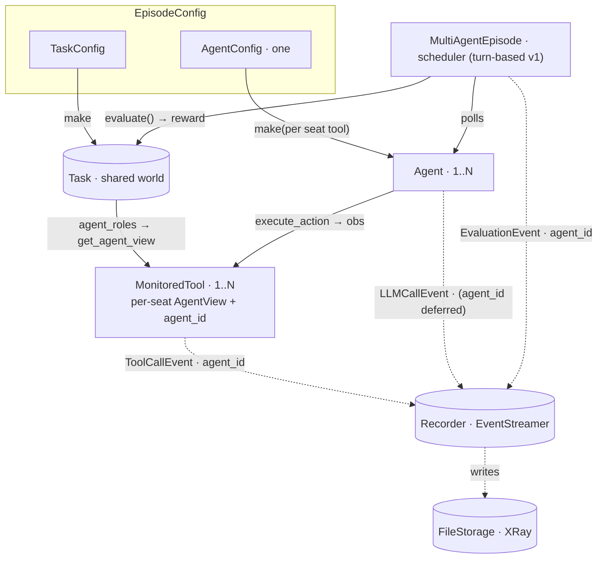

# RFC: Multi-agent episodes (cube-harness companion to `streamable-task`)

**Status:** DRAFT — high-level (we expand as we go)
**Author:** Alexandre Lacoste (w/ Claude)
**Date:** 2026-06-05
**Upstream:** `cube-standard/openspec/changes/streamable-task` (#214) — defines the task side.
**Lands with #214 (same change, not a follow-up):** single-agent is N=1 of the roster
(`{None: 1}`), so the arena ships **together** with the single-agent `AgentView` rewire —
only `async` / `batch` / real-time schedulers are left for later.

## Context

`streamable-task` (upstream) exposes a multi-agent task as **one `Task` (shared world)
+ N `AgentView`s**: `task.agent_roles()` gives the roster (`{role: count}`), and
`task.get_agent_view(role)` hands out one obs-in/action-out view per seat (its own
`agent_id` + dynamic `action_set`). The standard owns the *world*; cube-harness owns the
*runtime* — so this companion is just "how the harness drives N agents over those views."
Target first deliverable: a real multi-agent CUBE next week.

## What changes (harness)

### 1. `MultiAgentEpisode` (a sibling of `Episode`)
A new runtime object. Today's `Episode` drives one agent loop; `MultiAgentEpisode` builds
the task once, calls `build_agent_tools(task, streamer)` (one `MonitoredTool` per seat,
each wrapping an `AgentView`), builds one agent per seat, and drives them under a
**scheduler**. Single-agent `Episode` stays as the **N=1 fast path** (no scheduler) — both
finalize the same way.

### 2. One `AgentConfig`, produced per seat
`EpisodeConfig` carries a **single `AgentConfig`** (homogeneous agents — same policy,
different identity / action space per seat). The arena calls it once per seat's tool:

```python
seats = [agent_config.make(env_tool.action_set, agent_id=env_tool.agent_id, role=env_tool.role)
         for env_tool in build_agent_tools(task, streamer)]
```

So **`AgentConfig.make()` gains identity from the seat's `MonitoredTool`** (`agent_id`,
`role`, and the per-agent `action_set`). One config, N right-shaped agents. *(Heterogeneous
agents — different policies per role — is a forward extension: an `AgentConfig` per role / a
mapping. Out of v1.)*

### 3. Scheduler — start **turn-based**, sequential, sync
v1 is **round-robin turn-based**: the arena polls agent *i*, runs its turn, advances. This
**reuses the clean sync-episode model** from #492 (no event loop on the thread) — so it
inherits sync-Playwright / single-stack-pdb for free and dodges the async concurrency
traps. `async` (N concurrent loops over serialized world state) and `batch` (barrier +
joint resolution) are **deferred**; the task can already gate legality ("not your turn" →
`StepError`).

**Legality lives in the cube, scheduling in the arena.** Per upstream, `AgentView.action_set`
is a **dynamic property** (recomputed per turn) — so phase gating, legal-action masking, and
real-time observe/no-op are expressed by the *cube*, and the arena only decides *who it polls
next*. v1 agents still **snapshot `action_set` at `make()`** (fine — no current cube varies
it); wiring the per-turn re-read is a forward extension, deferred until a cube needs a
changing action set.

### 4. Trajectory gains an `agent_id` dimension
Capture is harness-side (no standard `Streamer`, per upstream): seats share one
`EventStreamer`, and the arena **recovers reward from `task.evaluate()`** (it holds the
task). v1 tags **`ToolCallEvent` + `EvaluationEvent`** with a nullable `agent_id`
(`None`/`"agent"` single-agent, `"{role}-{seat}"` multi-agent). Per-seat tagging of
`LLMCallEvent` — and full per-agent trajectory demux / XRay per-agent lanes — is
**deferred** (the single shared streamer is enough for the v1 multi-agent CUBE).

### 5. Termination + budget — start simple
- **Termination:** the episode ends when **all seats are retired OR the budget is
  exhausted**. A seat retires on empty actions, a step error, or `AgentStop` (the agent
  emitted `final_step`, or `task.finished()` returned True after its action).
- **Budget:** v1 = one **joint** episode budget shared by every seat; `BudgetExceeded` is
  the joint stop (ends the episode for all seats). Per-agent budgets are a forward option.

## Flow



## v1 scope (the multi-agent CUBE next week)

Fixed N agents · turn-based · homogeneous (one `AgentConfig` parameterized per seat)
· sync · one joint budget · per-agent + episode finalize. Everything else deferred.

## Settled in v1 (shipped)

- `AgentConfig.make(action_set, agent_id=..., role=...)` — identity comes from the seat's
  `MonitoredTool`; v1 agents ignore `role` (homogeneous).
- Termination = all-seats-retired OR joint budget exhausted (see §5).
- Per-step `evaluate` cadence lives in `MonitoredTool` (the `AgentView` eval callback
  → `EvaluationEvent` parented to the just-recorded `ToolCallEvent`), not in `agent.run`.

## Open decisions (deferred past v1)

1. Heterogeneous agents (per-role configs / a `{role: AgentConfig}` map) — when.
2. `async` / `batch` schedulers — after turn-based lands.
3. Per-agent (vs the v1 joint) budget.
4. Per-seat `LLMCallEvent` tagging + per-agent trajectory demux / XRay lanes.

`deltas.md` stays thin until v1 firms up.
