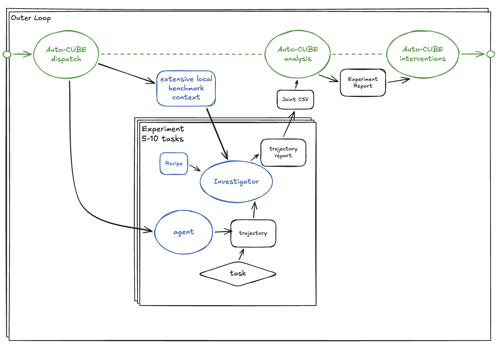

# Using Auto-CUBE

**Auto-CUBE** is the iterate-and-fix outer loop: you start a session
with a target (a cube + an open question), Auto-CUBE runs experiments,
dispatches the **Investigator** sub-agent per trajectory, classifies
failures, and ships Fix Report PRs against the auto-fix methodology.
Each invocation runs a specific **use-case** — same outer-loop
skeleton, different goal function and dispositions.

Companion to [`/new-cube`](https://github.com/The-AI-Alliance/cube-standard/tree/main/.claude/skills/new-cube)
(scaffold a cube from scratch) and [`/review-cube`](https://github.com/The-AI-Alliance/cube-standard/tree/main/.claude/skills/review-cube)
(audit against invariants before submission). The workflow is
**scaffold → audit → iterate**. Once a cube passes `cube test`,
Auto-CUBE is what finds everything that only surfaces when real LLMs
touch the benchmark.

## Use-cases

| Slash command | Use-case | What it's for |
|---|---|---|
| `/auto-cube` (alias) | → debug | Defaults to the debug use-case |
| `/auto-cube-debug` | debug | Curious-scientist sparse-coverage investigation; ships Fix Report PRs |
| `/auto-cube-hinter` | hinter | Raises benchmark performance by adding knowledge at the right regularization level (task-hint cheat → promoted clarification / benchmark prompt / action description / new action / system prompt); ships promotion PRs |
| (future) | profile / optimization / capability | Plug into the same skeleton with different goals |

Each use-case lives at `src/cube_harness/auto_cube/use_cases/<name>/` and
exposes a `SKILL.md` (loaded as the agent's system prompt) plus an
optional `investigator_extra.md` (biasing fragment passed to the
Investigator at dispatch time).

To add a new use-case, invoke `/new-auto-cube-use-case`. It interviews
you and scaffolds the directory + SKILL.md from a template.

## When to use Auto-CUBE (debug)

- A cube passes `cube test` (debug suite green) but fails for real LLMs;
  you need to know whether it's the scaffold, the infra, the model, or
  the benchmark itself.
- You're hardening an existing cube against a new infra backend (toolkit,
  Daytona, AWS, Modal, …).
- You're hunting design rot in `cube_harness`: the same bug keeps
  reappearing in different cubes' fix queues.
- You want a multi-day diagnostic run with paper-trail provenance:
  `REPORT.md` + Fix Report PRs + design-debt issues, plus the
  `coverage.json` ledger across sessions.

Don't use Auto-CUBE for a single one-shot fix, a quick test of one
model on one task, or anything that finishes in under an hour of focused
human work — the methodology overhead doesn't pay off at that scale.

## Setup

In a fresh Claude Code session with cube-harness as the working
directory:

1. **cube-harness on `dev`**, latest pulled.
2. **Env vars** (export in shell or `.env`):
   - `ANTHROPIC_API_KEY` — Investigator + Genny when using `claude-*` models
   - `AZURE_OPENAI_API_KEY` + `AZURE_OPENAI_ENDPOINT` — for `azure/gpt-*`
   - Cube-specific infra: `DAYTONA_API_KEY`, `EAI_PROFILE`, AWS, etc.
3. **Session path**: each session lives at `~/auto_cube/<session-id>/`,
   created on first run, holding the journal (`session.md`,
   `round_<N>/`, `REPORT.md`) under `journal/` and trajectory output
   under `experiments/` (export
   `CH_EXP_DIR=~/auto_cube/<session-id>/experiments` at session start).
   The cross-session ledger lives at `~/auto_cube/coverage.json`.
4. **Parallel sessions on the same machine**: each session needs its
   own integration worktree + `.venv` + session dir. See
   [§6 of the methodology spec](../../../openspec/specs/auto-fix/spec.md).

## Prompt template (debug use-case)

Drop this into a fresh Claude Code session (cube-harness as cwd; the
`auto-cube-debug` skill auto-loads). Fill the angle-bracket slots:

> Use the Auto-CUBE debug use-case to **<objective>** on `<cube-name>`.
> Start a session at `~/auto_cube/<cube>-<focus>-r0/`. Set up an
> integration worktree off `origin/dev` with its own `.venv`, and
> export `CH_EXP_DIR=~/auto_cube/<cube>-<focus>-r0/experiments`. Read
> `~/auto_cube/coverage.json`
> to identify the highest-value gap relevant to my focus, and scan
> `~/cube_harness_results/` for reusable experiments the Investigator
> hasn't seen yet.
>
> Zoom out first: a broad task slice on a cheap model and a single
> agent/infra combination. The Investigator emits `BaseFindings` per
> episode (canonical 10-category `primary_blame`, `outcome`,
> evidence) — aggregate into coverage states (covered /
> model-ceiling-done / zoom-in candidate) using the 3-bucket
> agent/tool/benchmark grouping. Then zoom in on the candidates,
> sweeping one axis at a time among `<axes-to-vary>`. File Fix
> Reports per `openspec/specs/auto-fix/spec.md` for confirmed root
> causes; update `coverage.json` as cells get classified.
>
> Experiment outputs land under the session's `experiments/` (via
> `CH_EXP_DIR`), not the default `~/cube_harness_results/`. Per-round
> budget ≈ `$<X>`. Stop when the
> ledger gap is closed or independent failure modes are exhausted.
> Final deliverable: `REPORT.md`.

Adjust to scope: wider sweeps cost more but build coverage faster;
narrower sweeps drill deeper into a specific failure mode. The
agent's SKILL.md describes the discipline; you set the focus.

## What you get back

| Artefact | Where | Purpose |
|---|---|---|
| `REPORT.md` | `~/auto_cube/<session-id>/journal/REPORT.md` | Single human-readable rollup: scope, arc, findings ledger, shipped/open PRs, design signals, cost |
| `session.md` | same `journal/` dir | Live scope + tracker (lighter than REPORT.md) |
| `round_<N>/notes.md` | same `journal/` dir | Per-round hypothesis → result trail |
| experiment output | `~/auto_cube/<session-id>/experiments/` | Trajectories (via `CH_EXP_DIR`; overrides default `~/cube_harness_results/`) |
| `done.json` | same `journal/` dir | Per-task dispositions for this session |
| `coverage.json` | `~/auto_cube/coverage.json` | **Cross-session** sparse coverage ledger across `task × infra × tool × model × agent-config` |
| Fix Report PRs | cube-harness (or cube-standard) | One PR per fix; body matches `templates/fix_report.md` |
| `design-debt` issues | cube-harness | L2/L3 fixes that need refactoring; stay open across PRs |
| `meta_analysis.{json,md}` | each experiment dir + journal mirror | Investigator's structured per-batch synthesis |

## Cost & runtime

Rough order, adjust per model and infra.

- **Zoom-out round** = broad task slice on a cheap model. With
  `claude-haiku-4-5` + cheap infra: ~$3–10 per round depending on
  slice size.
- **Zoom-in round** = small task subset, axis sweep. Cost depends on
  what you vary; ~$5–15 typical.
- Session = a zoom-out + 2–5 zoom-ins typically, 1–3 days wall clock
  with reviews.

The Investigator + fix-audit dominate per-trajectory cost
(~$0.05–0.20 each); cap them if you're sweeping wide.

## Parallel sessions

You can run two or more Auto-CUBE sessions on one machine. Pick
**orthogonal cubes** (one tbench2, one swe-bench, etc.) so PRs
naturally land in different paths. Each session = its own worktree +
`.venv` + journal subdir. Cross-session conflicts on shared layers
(infra, tool, LLM wrapper) are resolved **at merge time** via the
`Incompatible-with: #N` note in the PR body — not prevented in
real-time. Full pattern in [§6 of the methodology spec](../../../openspec/specs/auto-fix/spec.md).

## Related

- [auto-fix methodology spec](../../../openspec/specs/auto-fix/spec.md)
  — what fixes look like, depth taxonomy (L0–L3), provenance
- [`use_cases/debug/SKILL.md`](use_cases/debug/SKILL.md) — the agent's
  description of the debug loop
- [Investigator use cases](../analyze/investigator/use_cases/)
  — the per-trajectory recipes Auto-CUBE dispatches
- [`/new-cube`](https://github.com/The-AI-Alliance/cube-standard/tree/main/.claude/skills/new-cube)
  — scaffold a new cube
- [`/review-cube`](https://github.com/The-AI-Alliance/cube-standard/tree/main/.claude/skills/review-cube)
  — self-audit before registry submission
- `/new-auto-cube-use-case` — scaffold a new Auto-CUBE use-case (sibling
  to this one)
